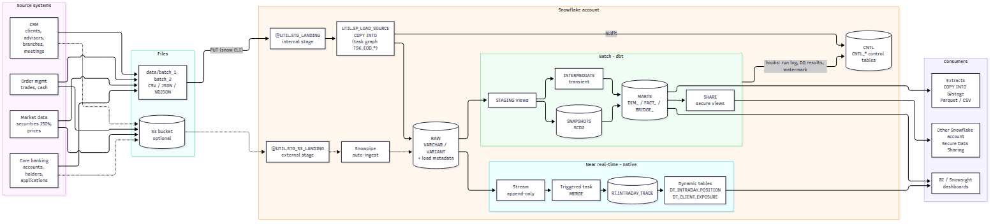
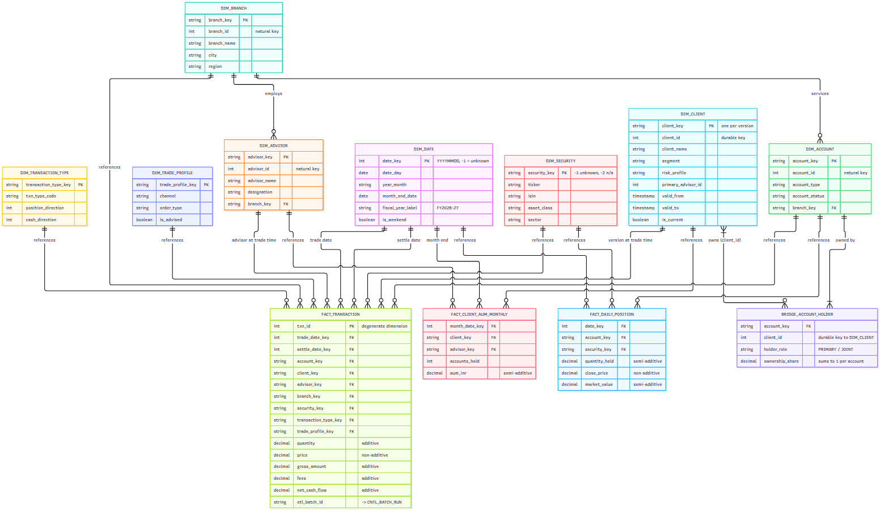

# WM Data Warehouse: Snowflake + dbt, end to end

A complete but small wealth-management data warehouse built **only with Snowflake and dbt**. It is
designed as a learning and interview project. Source files arrive from 4 systems and land in a
Snowflake stage. Snowflake loads them, keeps an intraday view fresh with streams, tasks and dynamic
tables, and dbt builds a tested dimensional model with every common fact and dimension pattern.



## What's inside

| Area | Contents |
|---|---|
| **Data model** (dbt) | 8 `DIM_*` (SCD1, SCD2, junk, role-playing date, snowflaked branch), 1 `BRIDGE_*`, 6 `FACT_*` (transaction, periodic snapshot, accumulating snapshot, factless event, factless coverage, aggregate), 1 secure share view |
| **Control tables** | `CNTL_SOURCE_CONFIG`, `CNTL_BATCH_RUN`, `CNTL_FILE_LOAD_AUDIT`, `CNTL_WATERMARK`, `CNTL_DQ_RESULT`. Written by Snowflake tasks **and** dbt hooks |
| **Source data** | `data/batch_1` (8 weeks) and `data/batch_2` (next week: SCD2 changes, workflow progress, new trades). CSV, JSON array and NDJSON, with deliberate defects |
| **Native Snowflake** | `snowflake/core/00-08` build the platform. `snowflake/labs/L01-L13` cover every major feature (see the [feature map](docs/04_snowflake_feature_map.md)) |
| **Quality** | ~135 dbt tests: generic, custom generic and singular. Results are stored in `CNTL_DQ_RESULT` |
| **CI/CD** | GitHub Actions: PR → isolated `CI_<pr>` schemas, dropped afterwards; main → prod |
| **Docs** | [1. DWH basics](docs/01_dwh_basics.md) · [2. Data model + ER diagrams](docs/02_data_model.md) · [3. Architecture & data flow](docs/03_architecture_data_flow.md) · [4. Snowflake feature map](docs/04_snowflake_feature_map.md) |



## Quick start

### 0. Prerequisites
* A Snowflake account. Choose **Enterprise** on a trial if you want the masking / row-access /
  materialized view labs.
* Python 3.10+, the Snowflake CLI (`pip install snowflake-cli`) and key-pair auth for your user.

```bash
mkdir -p ~/.snowflake && cd ~/.snowflake
openssl genrsa 2048 | openssl pkcs8 -topk8 -inform PEM -out rsa_key.p8 -nocrypt
openssl rsa -in rsa_key.p8 -pubout -out rsa_key.pub
# Snowsight:  ALTER USER <you> SET RSA_PUBLIC_KEY = '<contents of rsa_key.pub without header/footer>';
```

`~/.snowflake/connections.toml` (used by `snow` and the upload script):

```toml
default_connection_name = "wm"
[wm]
account = "<org-account>"
user = "<you>"
authenticator = "SNOWFLAKE_JWT"
private_key_file = "~/.snowflake/rsa_key.p8"
role = "SYSADMIN"
warehouse = "WM_LOAD_WH"
```

### 1. Build the Snowflake platform (Snowsight worksheets, in order)
`snowflake/core/00_account_setup.sql` → `01_rbac.sql` → `02_control_tables.sql` →
`03_file_formats_and_stages.sql` → `04_raw_tables.sql` → `05_load_framework.sql` (procedure part)

### 2. Day 1: load and transform
```bash
./scripts/upload_batch.sh batch_1          # PUT files into @UTIL.STG_LANDING
```
Then in Snowsight, run `06_tasks_eod_graph.sql` (it creates the task graph and runs it), then
`07_streams_realtime.sql` and `08_dynamic_tables.sql`.

```bash
python -m venv .venv && source .venv/bin/activate
pip install -r requirements.txt
cp profiles.yml.example ~/.dbt/profiles.yml
export SNOWFLAKE_ACCOUNT=<org-account> SNOWFLAKE_USER=<you> SNOWFLAKE_PRIVATE_KEY_PATH=~/.snowflake/rsa_key.p8
dbt debug
dbt build                                   # seeds, snapshot, 30 models, ~135 tests -> DEV_* schemas
dbt docs generate && dbt docs serve         # lineage graph
```

### 3. Day 2: incremental run
```bash
./scripts/upload_batch.sh batch_2
```
```sql
EXECUTE TASK WM_MICRO.UTIL.TSK_EOD_ROOT;    -- loads only the new files; the stream fires the RT task
```
```bash
dbt build                                   # MERGE new trades, SCD2 new versions, onboarding updated
```
Then explore `analyses/` (`dbt compile` and paste into Snowsight) and the control tables:

```sql
SELECT * FROM WM_MICRO.CNTL.CNTL_BATCH_RUN ORDER BY started_at DESC;
SELECT * FROM WM_MICRO.DEV_MARTS.DIM_CLIENT WHERE client_id IN (1002, 1011, 1020) ORDER BY client_id, version_no;
SELECT * FROM WM_MICRO.DEV_MARTS.FACT_ACCOUNT_ONBOARDING ORDER BY application_id;
```

### 4. Feature labs
Open any `snowflake/labs/L*.sql`. Each header lists its prerequisites, the edition it needs and
whether it runs on a trial. The labs cover:
* loading in depth
* Snowpipe / external tables (S3)
* streams
* tasks
* cloning and Time Travel
* unloading
* data sharing
* replication
* governance
* JSON
* UDFs and procedures
* performance
* monitoring and alerts

### 5. Cost control
* Everything runs on XSMALL warehouses with 60 s auto-suspend and a 10-credit resource monitor.
* The EOD root task is left **suspended**, so it only runs when you `EXECUTE TASK` it.
* After experimenting:
  ```sql
  ALTER TASK WM_MICRO.RT.TSK_MERGE_INTRADAY_TRADE SUSPEND;
  ALTER DYNAMIC TABLE WM_MICRO.RT.DT_CLIENT_EXPOSURE SUSPEND;
  ```
* `snowflake/99_teardown.sql` removes everything.

## Repository layout
```
data/                      source extracts (batch_1, batch_2) + generate_data.py
scripts/upload_batch.sh    PUT a batch into the stage with the snow CLI
snowflake/core/            00-08 platform build (run in order)
snowflake/labs/            L01-L13 feature labs (independent)
snowflake/99_teardown.sql
models/staging/            stg_<system>__<entity> views + sources.yml (freshness)
models/intermediate/       int_* transient tables
models/marts/dimensions/   dim_*
models/marts/bridge/       bridge_account_holder
models/marts/facts/        fact_*
models/share/              secure view for data sharing
snapshots/                 snap_client (SCD2)
seeds/                     ref_transaction_type
macros/                    schema naming, surrogate keys, CNTL logging hooks, governance post-hook, ops, tests
tests/                     singular data tests
analyses/                  factless gap analysis, onboarding funnel, SCD2 point-in-time, semi-additive, pipeline health
ci/ + .github/workflows/   CI/CD with key-pair auth
docs/                      beginner guide, ER diagrams, data flow, feature map
```

## Naming conventions
| Prefix | Meaning | Example |
|---|---|---|
| `DIM_` | dimension | `DIM_CLIENT` |
| `FACT_` | fact | `FACT_TRANSACTION` |
| `BRIDGE_` | many-to-many bridge | `BRIDGE_ACCOUNT_HOLDER` |
| `CNTL_` | control / audit | `CNTL_BATCH_RUN` |
| `STG_` / `stg_` | stage object / staging model | `STG_LANDING`, `stg_oms__transaction` |
| `INT_` | intermediate model | `int_application_milestones` |
| `SNAP_` | dbt snapshot | `snap_client` |
| `SHARE_` | object exposed via a share | `SHARE_CLIENT_AUM_MONTHLY` |
| `FF_` / `TSK_` / `STRM_` / `DT_` / `SP_` / `FN_` / `MP_` / `RAP_` | file format / task / stream / dynamic table / procedure / function / masking policy / row access policy | `FF_CSV`, `TSK_EOD_ROOT` |
| `_column` | load metadata column | `_loaded_at`, `_source_file` |
| `*_key` / `*_id` | surrogate key / natural key | `client_key` / `client_id` |

## GitHub secrets for CI
`SNOWFLAKE_ACCOUNT`, `SNOWFLAKE_USER`, `SNOWFLAKE_PRIVATE_KEY` (the full `rsa_key.p8` text). The
CI user needs the `WM_TRANSFORMER` role.
