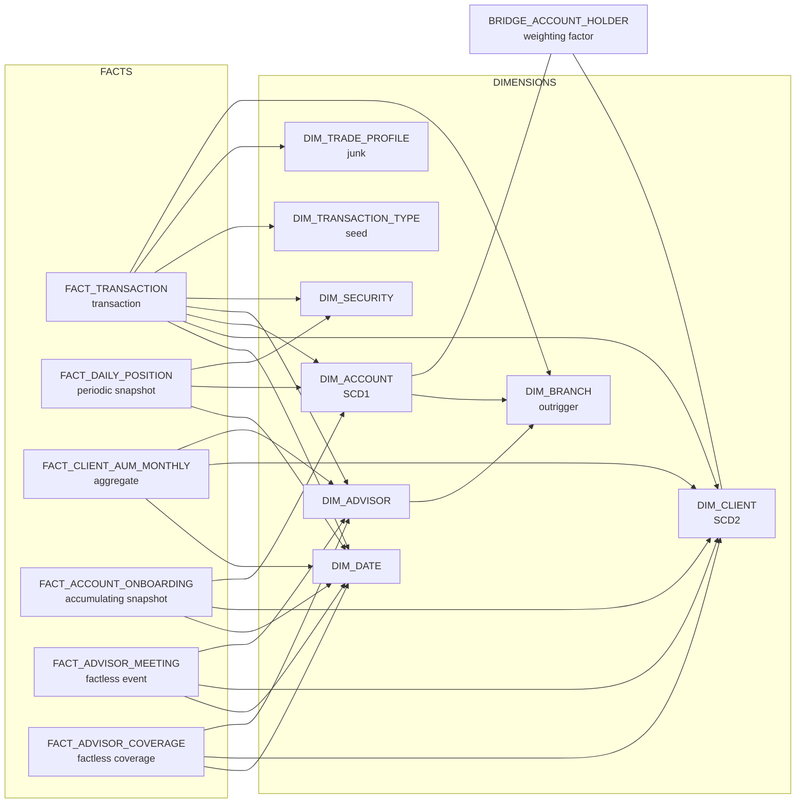
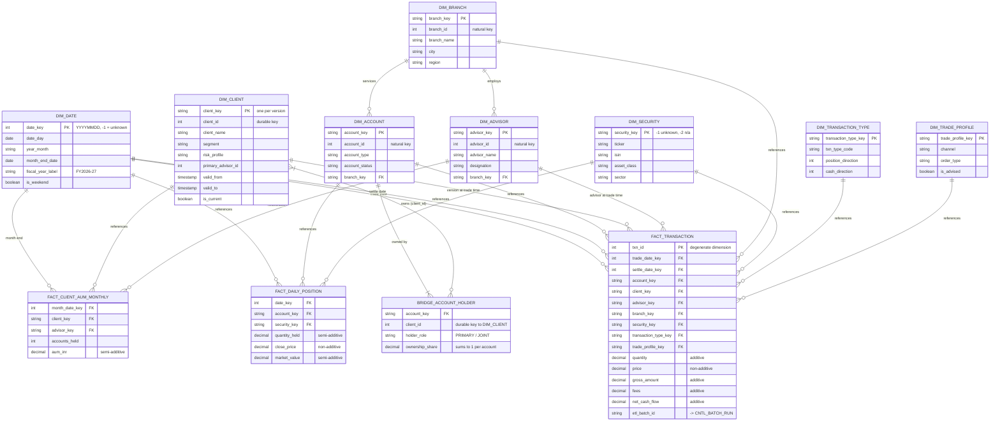
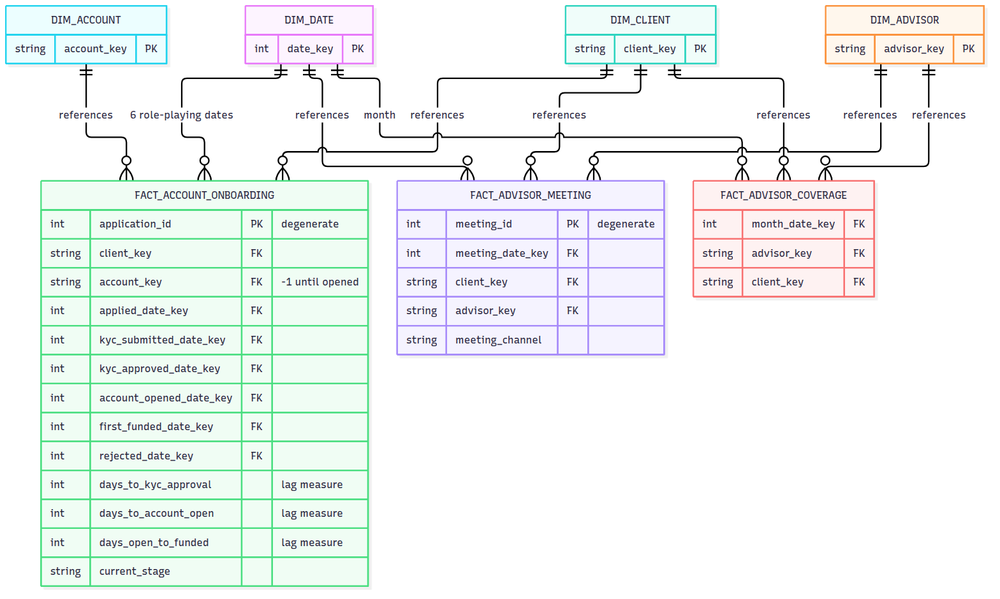
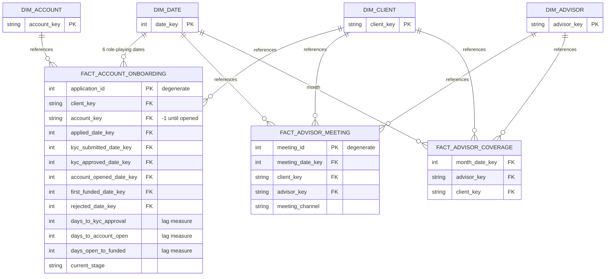
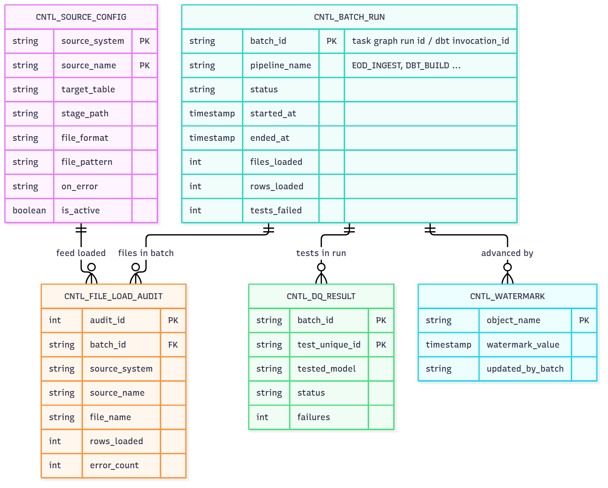
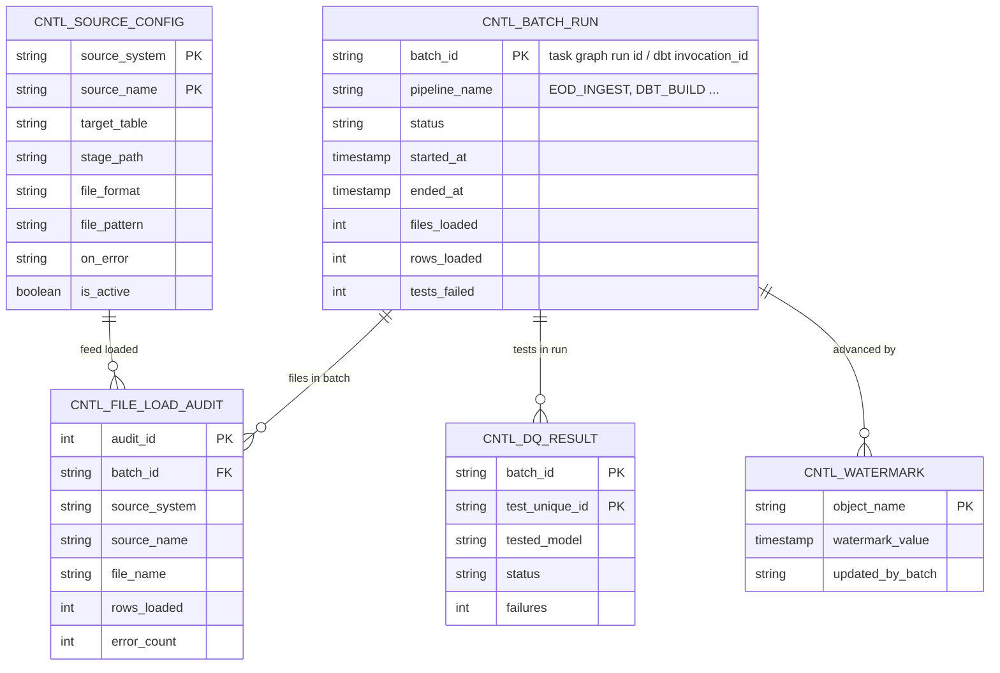

# 2. Data model: ER diagrams, table catalogue, bus matrix

GitHub renders the diagrams below. In VS Code, use a Mermaid preview extension. `dbt docs generate && dbt docs serve`
shows the same lineage interactively.

## 2.1 Overview: how the 16 mart tables connect



## 2.2 ER diagram: trading star (transaction, positions, AUM)


Mermaid source (renders on GitHub):



## 2.3 ER diagram: relationship-management star (onboarding, meetings, coverage)






## 2.4 ER diagram: control tables






## 2.5 Table catalogue

| Table | Kind | Grain / purpose | Built from | Materialisation |
|---|---|---|---|---|
| `DIM_DATE` | dimension (generated, role-playing) | one day 2015-2030 + unknown | `GENERATOR` | table |
| `DIM_BRANCH` | dimension (outrigger) | one branch | RAW.CRM_BRANCH | table |
| `DIM_ADVISOR` | dimension, snowflaked to branch | one advisor | RAW.CRM_ADVISOR | table |
| `DIM_CLIENT` | dimension, SCD2 | one client version | RAW.CRM_CLIENT → `snap_client` | table |
| `DIM_ACCOUNT` | dimension, SCD1 | one account | RAW.CORE_ACCOUNT | table |
| `DIM_SECURITY` | dimension | one security (+ unknown, n/a) | RAW.MKT_SECURITY (JSON) | table |
| `DIM_TRANSACTION_TYPE` | dimension (reference) | one transaction type | `seeds/ref_transaction_type.csv` | table |
| `DIM_TRADE_PROFILE` | junk dimension | one channel × order type × advised combination | RAW.OMS_TRANSACTION | table |
| `BRIDGE_ACCOUNT_HOLDER` | bridge | one account × holder | RAW.CORE_ACCOUNT_HOLDER | table |
| `FACT_TRANSACTION` | transaction fact | one txn_id | RAW.OMS_TRANSACTION | **incremental MERGE**, clustered by txn_date |
| `FACT_DAILY_POSITION` | periodic snapshot | account × security × day | FACT_TRANSACTION + prices (ASOF JOIN) | table, clustered by position_date |
| `FACT_CLIENT_AUM_MONTHLY` | aggregate fact | client × month end | FACT_DAILY_POSITION + bridge | table |
| `FACT_ACCOUNT_ONBOARDING` | accumulating snapshot | one application | RAW.CORE_APPLICATION_EVENT + first deposit | table |
| `FACT_ADVISOR_MEETING` | factless (event) | one meeting | RAW.CRM_MEETING (NDJSON) | table |
| `FACT_ADVISOR_COVERAGE` | factless (coverage) | advisor × client × month | DIM_CLIENT (SCD2) | table |
| `SHARE.SHARE_CLIENT_AUM_MONTHLY` | secure view | client × month, no PII | FACT_CLIENT_AUM_MONTHLY | secure view |
| `CNTL_*` (5) | control | see 01_dwh_basics §1.4 | native DDL | permanent tables |
| `RT.INTRADAY_TRADE` + `RT.DT_*` (3) | real-time | intraday trades / positions / exposure | stream + triggered task, dynamic tables | native |

Plus 11 staging views, 3 intermediate transient tables and 1 snapshot table.

## 2.6 Bus matrix (which fact uses which conformed dimension)

| Fact \ Dimension | Date | Client | Account | Advisor | Branch | Security | Txn type | Trade profile |
|---|:-:|:-:|:-:|:-:|:-:|:-:|:-:|:-:|
| FACT_TRANSACTION | ✔ ✔ (trade, settle) | ✔ | ✔ | ✔ | ✔ | ✔ | ✔ | ✔ |
| FACT_DAILY_POSITION | ✔ | (via bridge) | ✔ | | | ✔ | | |
| FACT_CLIENT_AUM_MONTHLY | ✔ | ✔ | | ✔ | | | | |
| FACT_ACCOUNT_ONBOARDING | ✔ ×6 | ✔ | ✔ | | | | | |
| FACT_ADVISOR_MEETING | ✔ | ✔ | | ✔ | | | | |
| FACT_ADVISOR_COVERAGE | ✔ | ✔ | | ✔ | | | | |

## 2.7 How a question becomes SQL

*"Net cash flow by branch region and asset class for September, for UHNI clients, using the
segment they were in at the time of each trade"*

```sql
select b.region, s.asset_class, sum(f.net_cash_flow) as net_flow
from MARTS.FACT_TRANSACTION f
join MARTS.DIM_DATE     d on d.date_key     = f.trade_date_key
join MARTS.DIM_CLIENT   c on c.client_key   = f.client_key      -- version at trade time
join MARTS.DIM_BRANCH   b on b.branch_key   = f.branch_key
join MARTS.DIM_SECURITY s on s.security_key = f.security_key
where d.year_month = '2026-09' and c.segment = 'UHNI'
group by 1, 2;
```

Every join is fact → dimension on a single key, and filters sit on dimension attributes. That's
the whole point of a star schema.
