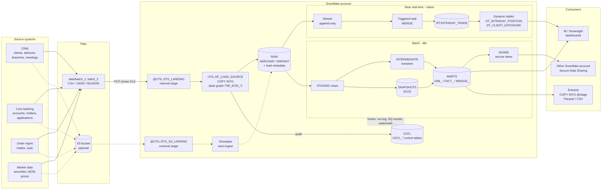

# 3. Architecture and data flow: from source file to dashboard

## 3.1 The big picture

Mermaid source:

There are two paths, and they're split deliberately:

* **Batch (dbt)** builds the governed, tested, historical dimensional model once a day. It's the
  source of truth.
* **Near real-time (native Snowflake)** keeps a lighter intraday view of positions and exposure
  fresh within minutes, using streams, a triggered task and dynamic tables. It doesn't need dbt or
  any scheduler.

## 3.2 Step by step: what happens to one trade

1. **The source system writes a file.** OMS writes `oms_transaction_week_20260928.csv`.
2. **Upload to a stage.** `./scripts/upload_batch.sh batch_2` runs `PUT`, which gzips the file and
   puts it in `@UTIL.STG_LANDING/oms/transaction/`. With S3 and Snowpipe, dropping the file in the
   bucket is enough.
3. **COPY INTO RAW.** The EOD task graph (`TSK_EOD_ROOT` → `TSK_LOAD_*`) calls
   `SP_LOAD_SOURCE('OMS', batch_id)`:
   * it reads `CNTL_SOURCE_CONFIG`, builds the COPY statement from the RAW table's columns, and
     loads only files it hasn't loaded before (load metadata)
   * it stamps every row with `_source_file`, `_file_row_number`, `_batch_id` and `_loaded_at`
   * it writes one row per file into `CNTL_FILE_LOAD_AUDIT`

   The finalizer task closes the `CNTL_BATCH_RUN` row.
4. **The real-time path reacts at once.** The append-only stream on `RAW.OMS_TRANSACTION` now has
   rows. The triggered task `RT.TSK_MERGE_INTRADAY_TRADE` fires, de-duplicates and MERGEs into
   `RT.INTRADAY_TRADE`. The dynamic tables refresh within their target lag.
5. **dbt batch run** (`dbt build`, from GitHub Actions or by hand):
   * The on-run-start hook opens a `CNTL_BATCH_RUN` row (batch id = dbt `invocation_id`).
   * **Staging:** `stg_oms__transaction` casts with `TRY_TO_*`, cleans `'buy '` to `BUY`, and
     drops the re-sent duplicate with `QUALIFY`.
   * **Snapshot:** `snap_client` closes the old version of any client whose `updated_at` moved
     (SCD2).
   * **Dimensions** are rebuilt (hash surrogate keys are stable across rebuilds).
   * **`FACT_TRANSACTION`** processes only rows with `_loaded_at` after the last watermark. Each
     trade looks up its keys: the client version valid at trade time, the advisor at that time,
     the security (or `-1` for the unknown ticker), the transaction type and the junk-dimension
     profile. It then MERGEs on `txn_id`, and the post-hook updates `CNTL_WATERMARK`.
   * **`FACT_DAILY_POSITION`** recomputes holdings with an `ASOF JOIN` to prices.
     `FACT_CLIENT_AUM_MONTHLY` splits joint accounts using the bridge.
   * About 135 tests run. The on-run-end hook writes every result to `CNTL_DQ_RESULT` and closes
     the batch row.
6. **Consumption.**
   * Analysts query `MARTS` through `WM_BI_WH`.
   * The risk team reads `SHARE.SHARE_CLIENT_AUM_MONTHLY` through a share.
   * Finance gets a Parquet extract (COPY INTO `@STG_EXPORT`).

## 3.3 Environments

| | dev (laptop) | ci (pull request) | prod (main) |
|---|---|---|---|
| dbt target | `dev` | `ci` | `prod` |
| Schemas | `DEV_STAGING`, `DEV_MARTS` ... | `CI_<pr>_STAGING` ... dropped after | `STAGING`, `MARTS`, `SHARE` ... |
| Reads | same `RAW` + writes same `CNTL` | same | same |
| Clone trick | `dbt run-operation clone_schema --args '{source_schema: MARTS, target_schema: DEV_MARTS}'` gives dev real prod data instantly | | |

## 3.4 Run order (runbook)

| # | What | Where |
|---|---|---|
| 1 | Warehouses, database, schemas, resource monitor | `snowflake/core/00_account_setup.sql` |
| 2 | Roles and grants | `snowflake/core/01_rbac.sql` |
| 3 | Control tables + feed config | `snowflake/core/02_control_tables.sql` |
| 4 | File formats + stages | `snowflake/core/03_file_formats_and_stages.sql` |
| 5 | RAW tables | `snowflake/core/04_raw_tables.sql` |
| 6 | Load procedure | `snowflake/core/05_load_framework.sql` (create the procedure only; the manual CALLs are optional) |
| 7 | Upload batch 1 | `./scripts/upload_batch.sh batch_1` |
| 8 | EOD task graph, run it | `snowflake/core/06_tasks_eod_graph.sql` |
| 9 | Streams + triggered task | `snowflake/core/07_streams_realtime.sql` |
| 10 | Dynamic tables | `snowflake/core/08_dynamic_tables.sql` |
| 11 | dbt build (day 1) | `dbt build` |
| 12 | Upload batch 2, then `EXECUTE TASK UTIL.TSK_EOD_ROOT;` | day 2: incremental + SCD2 + accumulating snapshot updates |
| 13 | dbt build (day 2) | `dbt build` |
| 14 | Feature labs | `snowflake/labs/L01 ... L13` (any order) |
| 99 | Remove everything | `snowflake/99_teardown.sql` |

## 3.5 What changes between batch 1 and batch 2 (try it)

| Change in batch 2 files | Where you see it |
|---|---|
| Client 1002 risk profile AGGRESSIVE → MODERATE | `DIM_CLIENT` gets version 2; `snapshots.snap_client` |
| Client 1011 moved to another advisor | trades before 29-Sep keep the old advisor, later trades the new one (`analyses/scd2_point_in_time.sql`) |
| Client 1020 moved city, became UHNI | `DIM_CLIENT` version 2, `FACT_ADVISOR_COVERAGE` for October |
| Applications 7005, 7006 reach ACCOUNT_OPENED and get funded | `FACT_ACCOUNT_ONBOARDING` rows **updated** (accumulating snapshot) |
| Account 50015 closes | `DIM_ACCOUNT` status overwritten (SCD1) |
| A new week of trades and prices | `FACT_TRANSACTION` MERGE only touches new rows; `CNTL_WATERMARK` moves; the stream fires the RT task |
| Files already loaded are in the stage too | COPY skips them (load metadata); `CNTL_FILE_LOAD_AUDIT` shows only new files |
